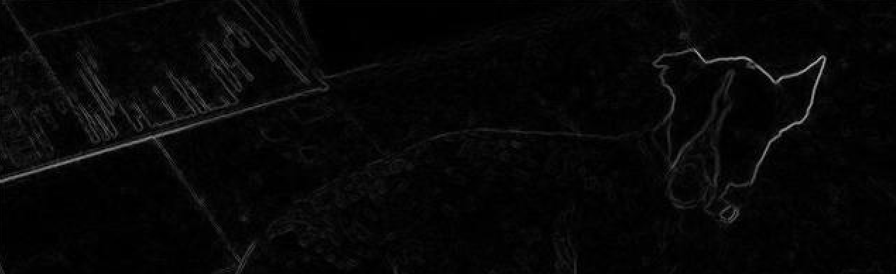

# HUJI Image Processing course (67829) Ex2 Tests
Version: v1.0

Testing suite for the second exercise of Image Processing course (67829) at HUJI. The suite includes basic tests for all of the exercises functions that checks the API, the return values, usage of loops and some functionality. In this README I will go over requirements, how to use the tests, each tests coverage and what it means to pass it.

## :warning: DISCLAIMER :warning:
Passing these tests DOES NOT guaranty you will get a good grade in any way, as they are not moderated by the course's staff.
I will try and make it as clear as possible as to which extent the tests cover the exercise, but i felt the disclaimer was needed in any case.  