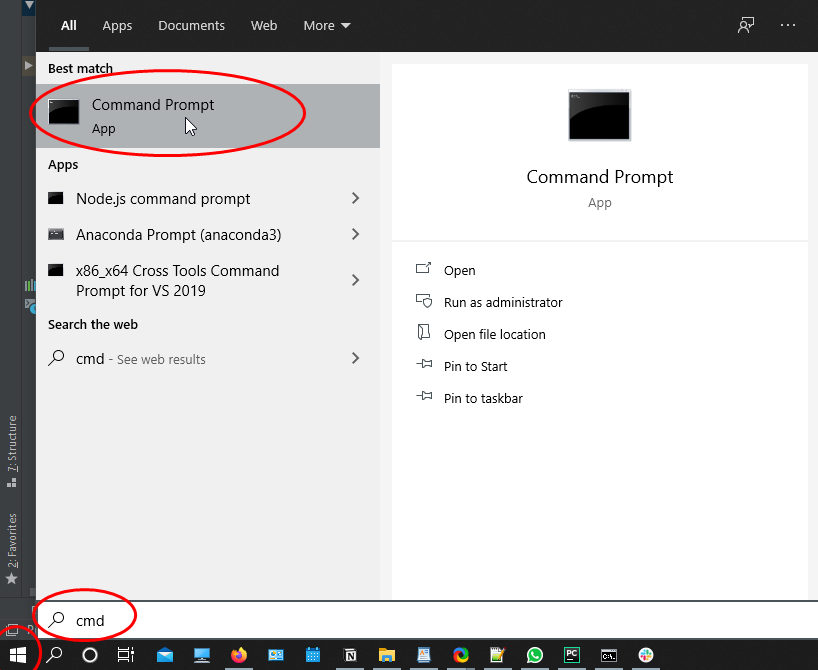
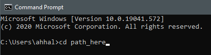
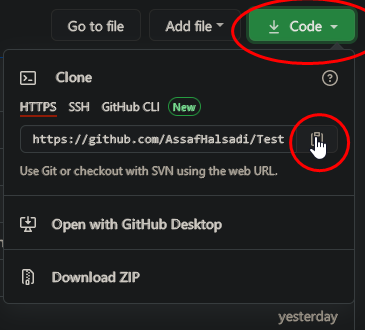
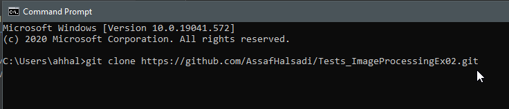
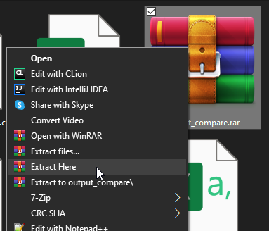
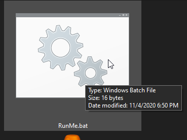
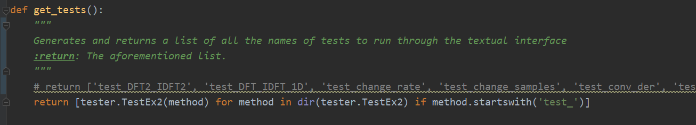
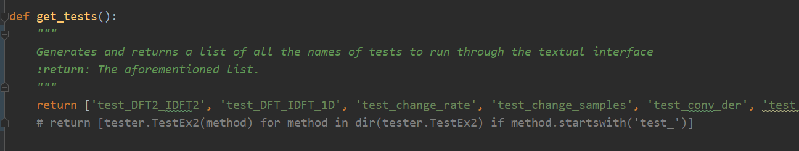
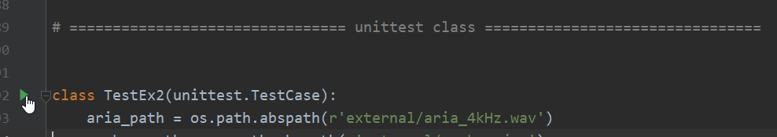
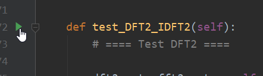

# HUJI Image Processing course (67829) Ex2 Tests 2020/2021

Testing suite for the second exercise of Image Processing course (67829) at HUJI. The suite includes basic tests for all of the exercises functions that checks the API, the return values, usage of loops and some functionality. In this README I will go over [requirements](#REQ), a [guide](#HOWTO) of how to use the tests, each tests coverage and what it means to pass it.

## :warning: DISCLAIMER :warning:
Passing these tests DOES NOT guaranty you will get a good grade in any way, as they are not moderated by the course's staff.
I will try and make it as clear as possible as to which extent the tests cover the exercise, but i felt the disclaimer was needed in any case.

## :books: Documentation

:arrow_up: _Easy navigation through this README file can be found here_ :arrow_up:

## Collaborators
[Assaf Halsadi](https://github.com/AssafHalsadi) :israel:

## Contact Info
If you find any mistakes, or have any questions - please contact me through the course's Slack 

Or at the courses forum at the relevant post 

## Requirements
To run the tests you will only need the following things:

## How to - running the tests
### Setup
1. Clone this repository into a _"tests"_ folder within your project's root folder:
    * Open a new folder named _"tests"_ in your project's root folder.
    * Open a command prompt on your computer, I will use cmd as an example on windows:
    
    
    * Go to the _tests_ folder using the `cd` command like so : `_cd [path_to_project]/tests` (change [path_to_project] with the path to your project):
     
    
    * Go to the [top of the page](#TOP), there you should copy the git link: 
    
    
    * Type `git clone *copy here*` :
    
     
    * You might be prompted to enter your [CSE user credentials](https://wiki.cs.huji.ac.il/wiki/Password_and_OTP#OTP_and_UNIX_passwords)
2. Unpack the _output_compare.rar_ located in the _output_compare_ folder.
 
3. Copy both _sol2.py_, _ex2_helper.py_ and any other files needed for your implementation to the _tests_ folder. 
3. That is it, no need for complicated voodoo. :smile:

### Usage
There are two main ways to run the tests, via the Textual Interface or via pycharm's built in unittest support.
#### Textual Interface
1. Go to the project's folder.
2. Go to the _tests_ sub-folder.
3. Double click on _'RunMe.bat'_:
 
If everything went according to plan, you should see a cmd window opens, and after a while the tests will start running.

**Remark**: Some of the tests take A LOT of time to complete. To run only SOME of the tests open the _runner.py_ and scroll down to this function:

Flip the comment like so:

and delete the names of the tests you don't want to run.
#### Pycharm
1. Go to _test _ sol2.py_ file, located in the "tests" folder.
2. To run all of the tests, scroll down to the TestSuite start and click the green "play" button :

3. To run an individual test, scroll down to the test's function and click on the green "play" button beside it :

You can identify tests by the face they all start with `def test_...`

